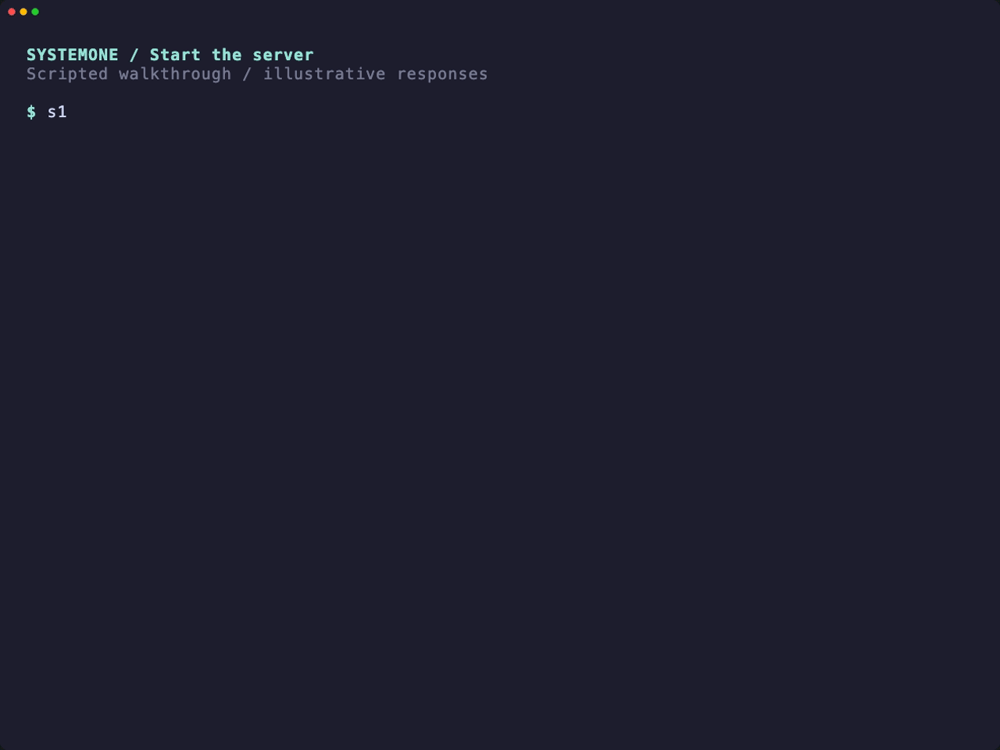

<a id="readme-top"></a>

# SystemOne

<a href="docs/demo.md"></a>

**One CLI and one Jev-compatible HTTP API for local and hosted decision models.**

Run `s1` once from the command line, or start `s1 serve` to keep models loaded
behind a Jev-compatible HTTP API. Both return typed JSON—no generated prose to
parse. Point your application at `s1` once; change the decision model in
configuration, not in code.

[Download a release](https://github.com/codesoda/systemone/releases)
· [Demo](docs/demo.md)
· [Report a bug](https://github.com/codesoda/systemone/issues)
· [Request a feature](https://github.com/codesoda/systemone/issues/new)

> **Status:** the `s1` binary, layered configuration, HTTP service and the
> OpenJev, Laya, GLiNER2 and TypeSafe backends are implemented. The local
> backends were exercised against real models and TypeSafe against its live
> hosted API, including the official TypeSafe JS SDK. Binary releases are
> built by CI on `v*` tags and currently ship OpenJev and TypeSafe; Laya and
> GLiNER2 are source builds. Vercel and OpenRouter backends are planned;
> enabling one today is a clear configuration error, not a silent fallback.
> Only the Apple Silicon build has been run with real weights.

## Table of contents

- [About the project](#about-the-project)
  - [Backends](#backends)
  - [Built with](#built-with)
- [Getting started](#getting-started)
  - [Prerequisites](#prerequisites)
  - [Install the CLI](#install-the-cli)
  - [Download a model](#download-a-model)
  - [Build from source](#build-from-source)
- [Usage](#usage)
  - [One-shot CLI](#one-shot-cli)
  - [JSON and batch input](#json-and-batch-input)
  - [Resident HTTP server](#resident-http-server)
  - [Use the TypeSafe JavaScript SDK](#use-the-typesafe-javascript-sdk)
- [Configuration](#configuration)
- [Models](#models)
- [Limitations](#limitations)
- [Documentation](#documentation)
- [Roadmap](#roadmap)
- [Contributing](#contributing)
- [License](#license)
- [Acknowledgments](#acknowledgments)

## About the project

Applications should not have to change their integration every time they
change decision models. SystemOne is the common interface and service layer.
It depends on the inference libraries in
[openjev-rs](https://github.com/codesoda/openjev-rs),
[laya-rs](https://github.com/codesoda/laya-rs) and
[gliner2-rs](https://github.com/codesoda/gliner2-rs); it does not merge or
rename those projects.

| Decision | Use it for | Result |
| --- | --- | --- |
| **Choice** | Routing a ticket or selecting a candidate | Selected option and probabilities |
| **Noul** | A yes/no question | Probability assigned to yes |
| **Score** | Rating against ordered levels | Probability-weighted expected level |

Use the **CLI** for shell pipelines and one-off decisions. Use the **HTTP
server** for repeated calls from applications or agents: it loads each enabled
backend once, then accepts requests through a bounded in-memory queue.

These are typed decisions, not generated prose. Matching an API schema does
**not** mean different models have the same accuracy or calibrated confidence.
Jev compatibility means the documented wire/API subset—not identical models,
answers or confidence. SystemOne is not affiliated with or endorsed by TypeSafe
AI, Vercel, OpenRouter, SemIf or other upstream authors.

### Backends

One trait connects every command and route to a backend:
`DecisionHost { capabilities(), evaluate(), shutdown() }`. Host-specific
abilities, such as a local model cache, are separate extension traits. Every
backend reports which extensions it supports and why not—a hosted passthrough
does not download models. `s1 backends` and `GET /v1/backends` show that
coverage.

| Kind | Implementation | Status |
| --- | --- | --- |
| `openjev` | Frozen LLM next-token scoring through `openjev-core` / `openjev-llama` | **Available.** Prompt/token parity and explicit serial fallback preserved |
| `laya` | Bidirectional encoder with trained decision heads through [laya-core](https://github.com/codesoda/laya-rs) | **Available** with `--features laya-cpu` (Candle) or `laya-metal` (MLX, Apple Silicon). Parity with the upstream Python runtime is gated in laya-rs; not in binary releases yet |
| `gliner2` | GLiNER2.5 zero-shot label classifier through [gliner2-rs](https://github.com/codesoda/gliner2-rs) and ONNX Runtime | **Available** with `--features gliner2` (CPU). Choice and Noul hold up on the held-out set; Score does not ([evaluation](docs/gliner2-evaluation.md)). Not in binary releases yet |
| `typesafe` | TypeSafe hosted Jev through `https://api.typesafe.ai/v1/systemone` | **Available.** Bearer API key from an operator-configured environment variable. `s1 backends` reports it unavailable while that variable is unset or empty; the hosted API is never probed, because a probe request is billed |
| `vercel` | Hosted Jev through Vercel AI Gateway | Planned |
| `openrouter` | Hosted Jev through OpenRouter | Planned |

Enable only the instances you need. Disabled local backends do not load
weights; disabled remote backends do not read credentials. There is **no
silent local-to-cloud fallback**.

### Built with

- [Rust](https://www.rust-lang.org/)
- [llama.cpp](https://github.com/ggml-org/llama.cpp) through [llama-cpp-2](https://github.com/utilityai/llama-cpp-rs), via openjev-rs
- [MLX](https://github.com/ml-explore/mlx) through [mlx-rs](https://github.com/oxideai/mlx-rs) and [Candle](https://github.com/huggingface/candle), via laya-rs
- [ONNX Runtime](https://onnxruntime.ai/) through [ort](https://github.com/pykeio/ort), via gliner2-rs
- [Hugging Face Hub](https://huggingface.co/) for pinned, checksum-verified GGUF weights
- [Axum](https://github.com/tokio-rs/axum) and [Tokio](https://tokio.rs/) for HTTP serving

## Getting started

### Prerequisites

For a prebuilt binary, **no Rust, Python, compiler, or Xcode installation is
needed**.

| Release target | Requirements |
| --- | --- |
| Apple Silicon macOS | macOS 14 or newer; Metal acceleration included |
| Linux x86-64 | glibc 2.35 or newer; system `libstdc++` and `libgcc`; CPU inference |

You need internet access for the initial binary/model download and enough disk
space for your chosen model. Model weights are not included in the archive. The
macOS binary is not Developer ID signed or notarized. Windows is not built yet.

### Install the CLI

The installer downloads a prebuilt release, verifies its SHA-256 checksum, and
installs it without `sudo`. No GitHub account, token, Python or `jq` is needed:

```sh
curl -fsSL https://raw.githubusercontent.com/codesoda/systemone/main/install.sh | sh
```

To pin a version:

```sh
curl -fsSL https://raw.githubusercontent.com/codesoda/systemone/main/install.sh | sh -s -- --version v0.1.0
```

- Versioned payloads and their license notices live under `~/.systemone/bin/`.
- `~/.systemone/bin/s1` selects the installed version; `~/.local/bin/s1` links to it.
- On macOS, the installer clears `com.apple.quarantine` from the verified
  executable with `xattr -d`. It does not change global Gatekeeper settings.

Rerun the installer to upgrade; previous payloads are retained. No shell startup
file is edited. If `~/.local/bin` is not on your PATH:

```sh
export PATH="$HOME/.local/bin:$PATH"
s1 --version
```

See [the installer source](install.sh) before running it, or follow the
[manual installation instructions](docs/RELEASE.md).

### Download a model

The built-in configuration has one backend, `local`, running OpenJev with the
smallest model. Download it once:

```sh
s1 openjev models pull qwen3-0.6b
```

Downloads are pinned and verified by size and SHA-256 into `~/.cache/openjev`.
Set `backends.local.settings.offline = true` (or `--set` it) to forbid downloads
once the model is cached.

### Build from source

<details>
<summary>Optional: build instead of downloading a release</summary>

Requires Rust 1.95 (pinned by `rust-toolchain.toml`). Local inference also
needs CMake and a C/C++ toolchain with clang/libclang. On macOS, install Xcode
Command Line Tools and CMake. On Ubuntu: `build-essential clang libclang-dev
cmake pkg-config`.

```sh
git clone https://github.com/codesoda/systemone.git
cd systemone

# Apple Silicon: Metal acceleration, with the Metal library embedded.
GGML_METAL=ON GGML_METAL_EMBED_LIBRARY=ON CARGO_TARGET_DIR=target-metal \
  cargo build --locked --release -p systemone-cli --features metal

# CPU-only build on Linux or macOS.
GGML_METAL=OFF CARGO_TARGET_DIR=target-cpu \
  cargo build --locked --release -p systemone-cli --features native
```

Keep CPU and Metal builds in separate target directories. Plain `cargo build`
deliberately omits llama.cpp: configuration, listing and the HTTP plumbing
work, but local inference returns `unavailable`.

Add `laya-cpu` (any platform, Candle without BLAS), `laya-accelerate` (macOS,
adds Apple's Accelerate BLAS) or `laya-metal` (Apple Silicon, MLX compiled from
source; needs CMake, includes `laya-accelerate`) to the feature list for the
Laya backend, for example `--features metal,laya-metal`. The build-time environment MLX needs is
set in `.cargo/config.toml`.

Add `gliner2` for the GLiNER2 backend. It links ONNX Runtime statically; the
`ort` crate fetches the pinned prebuilt library at build time, so the first
build needs network access. All three local runtimes link into one binary
(`--features metal,laya-metal,gliner2` was built and served all three
backends from one process on Apple Silicon).

</details>

## Usage

### One-shot CLI

A one-shot command loads the backend, answers, and exits. For repeated calls,
use [`serve`](#resident-http-server). Output has the same shape as the HTTP
response; diagnostics go to stderr.

**Choose an option:**

```sh
s1 decide --quiet --pretty \
  --state 'The customer was charged twice for their subscription.' \
  --question 'Which team should handle this ticket?' \
  --option Billing --option Support --option Sales
```

**Ask a yes/no question, with state piped from stdin:**

```sh
printf '%s' 'The customer explicitly asks for a refund.' | \
  s1 noul --quiet --question 'Does the customer request a refund?'
```

**Score against ordered levels:**

```sh
s1 score --quiet --pretty \
  --state-json '{"incident":"Checkout is unavailable","severity":3}' \
  --question 'How urgent is this incident?' \
  --level low --level medium --level high
```

| Option | Purpose |
| --- | --- |
| `--state`, `--state-file`, `--state-json`, `--state-json-file` | Exactly one state source, or pipe text on stdin |
| `--option-id ID --option TEXT` | Use `ID` as the label and `TEXT` as its description |
| `--backend NAME` | Select a configured backend instead of the default |
| `--set key=value` | Override any configuration leaf, e.g. `--set backends.local.settings.device=metal` |
| `--pretty` / `--quiet` | Indented JSON on stdout / warnings only on stderr |

Text is not guessed as JSON: use `--state-json` for structured input. Levels are
ordinal, as in the Jev API: the first is `0`, the last is `n-1`.
**stdout is JSON only; diagnostics go to stderr.** Exit codes: **0** success,
**1** runtime failure, **2** invalid arguments or input. Help is also JSON:

```sh
s1 --help | jq -r .text
s1 decide --help | jq -r .text
```

### JSON and batch input

Use `run` for a complete Jev request document:

```sh
printf '%s\n' \
  '{"state":"I was charged twice.","questions":{"route":{"type":"choice","criteria":{"billing":"Payments","support":"Product support"}}}}' \
  | s1 run --quiet
```

Use `--jsonl` for a file containing one request per line. The model loads once:

```sh
s1 run --quiet --jsonl --input requests.jsonl --output answers.jsonl
```

Every non-blank input line produces one output line in order: the response, or
`{"line": N, "error": {...}}`. A failed row does not stop the batch; a broken
backend does. A summary goes to stderr and the exit code is **1** if any row
failed.

### Resident HTTP server

```sh
s1 serve
```

Every enabled backend loads once. The default address is
`http://127.0.0.1:8080`. Leave this process running and send requests from
another terminal, with `s1 call` or any HTTP client:

```sh
s1 call --input request.json
```

**Or call the API directly:**

```sh
curl --fail-with-body --silent --show-error http://127.0.0.1:8080/readyz

curl --fail-with-body --silent --show-error -i \
  http://127.0.0.1:8080/v1/systemone \
  -H 'Content-Type: application/json' \
  --data-binary '{
    "model": "jev-latest",
    "state": {"ticket": "duplicate charge", "severity": 3},
    "questions": {
      "route": {
        "type": "choice",
        "instructions": "Which team should handle this?",
        "criteria": {"billing": "Payments and invoices", "support": "Product support"}
      },
      "review": {"type": "noul", "instructions": "Does a human need to review this?"},
      "urgency": {
        "type": "score",
        "instructions": "How urgent is this?",
        "criteria": ["low", "medium", "high"]
      }
    }
  }'
```

Response shape (**illustrative values**, not a promised prediction):

```json
{
  "model": "qwen3-0.6b",
  "answers": {
    "route": {
      "type": "choice",
      "choice": "billing",
      "confidence": 0.8,
      "probabilities": {"billing": 0.9, "support": 0.1}
    },
    "review": {"type": "noul", "noul": 0.75},
    "urgency": {
      "type": "score",
      "score": 1.2,
      "confidence": 0.25,
      "legend": {"0": "low", "1": "medium", "2": "high"},
      "probabilities": {"0": 0.15, "1": 0.5, "2": 0.35}
    }
  },
  "usage": {"input_tokens": 313, "output_tokens": 0}
}
```

`jev-latest` is an accepted alias for the selected backend's model, not a call
to hosted Jev; the response reports the actual model. `output_tokens` is zero
because nothing is generated. Routing evidence travels in headers, so the JSON
stays SDK-compatible: `x-systemone-backend`, `x-systemone-model`,
`x-systemone-request-id`, `x-systemone-elapsed-ms`, `x-systemone-execution`,
`x-systemone-fallback`, `x-systemone-probability-status` and
`x-systemone-truncation`.

| Endpoint | Purpose |
| --- | --- |
| `POST /v1/systemone` | Evaluate typed questions against a state |
| `GET /v1/models` | Models served by enabled backends |
| `GET /v1/backends` | Backend inventory and extension coverage |
| `GET /healthz` | Health check |
| `GET /readyz` | Readiness: every enabled backend loaded and not broken |

**Selecting a backend:** omit a selector to use `default_backend`. Otherwise
send a top-level `"backend": "name"` field or the `X-SystemOne-Backend`
header; both together must agree. A model name never selects a backend—an
unserved model is `404 not_found`.

**Serving behavior:** up to `server.max_admitted_jobs` (16) requests are
admitted across body reading, queuing and inference; each backend has its own
bounded queue and owner thread, so a slow backend does not block another. The
queue is in memory. The default 120-second deadline includes queue time;
overload returns HTTP 429, an elapsed deadline 504. Stop the server with
Ctrl+C or SIGTERM. Native inference cannot be interrupted mid-decode.

**Network access:** loopback needs no API key. Binding outside loopback
requires a bearer secret; terminate TLS at a trusted reverse proxy.

```sh
export S1_API_KEY='replace-with-a-long-random-secret'
s1 serve --host 0.0.0.0 --set server.api_key_env=S1_API_KEY
```

Clients then send `Authorization: Bearer <secret>` to the `/v1/*` routes;
`/healthz` and `/readyz` stay open for probes.

### Use the TypeSafe JavaScript SDK

The supported subset is smoke-tested with `@typesafe-ai/sdk` **0.6.0**
(`compat/sdk-js/`). In a Node.js project:

```sh
npm install @typesafe-ai/sdk@0.6.0
```

Save as `example.mjs` and run with `node example.mjs` while the server runs:

```js
import { TypeSafeClient, choice, noul, score } from "@typesafe-ai/sdk";

const client = new TypeSafeClient({
  apiKey: process.env.S1_API_KEY || "local-dummy-token",
  baseURL: "http://127.0.0.1:8080",
  timeout: 120_000,
  retry: { maxRetries: 0 },
});

const result = await client.systemOne({
  model: "jev-latest",
  state: { ticket: "The customer was charged twice." },
  questions: {
    route: choice("Which team?", { billing: "Payments", support: "Product support" }),
    review: noul("Does a human need to review this?"),
    urgency: score("How urgent?", ["low", "medium", "high"]),
  },
});

console.log(JSON.stringify(result, null, 2));
```

**Use the server root as `baseURL`, without `/v1`.** The SDK appends the path
itself. SDK bodies cannot carry a `backend` field, so either rely on
`default_backend` or run one `s1 serve` per backend. Request/response
compatibility does not imply the same predictions as hosted Jev.

## Configuration

`s1` reads TOML and resolves it once, in this order (later wins):

1. Built-in defaults: one `local` OpenJev backend, `qwen3-0.6b`, CPU.
2. `~/.systemone/systemone.config.toml`
3. `./systemone.config.toml`
4. `SYSTEMONE_*` environment variables, e.g. `SYSTEMONE_PORT=9090`,
   `SYSTEMONE_BACKENDS__LOCAL__SETTINGS__THREADS=8`
5. CLI flags and `--set key=value`

`s1 config show` prints the merged result with the source of every value;
`s1 config check` validates every backend's typed settings without loading
anything. `--no-config` ignores the files and environment.

```toml
default_backend = "local"

[server]
host = "127.0.0.1"
port = 8080

[backends.local]
kind = "openjev"
enabled = true
model = "qwen3-0.6b"

[backends.local.settings]
device = "cpu"      # "metal" on a Metal build; a mismatch is a startup error
threads = 4
```

See [examples/systemone.config.toml](examples/systemone.config.toml) for the
full shape, including disabled hosted backends. SystemOne never reads
`OPENJEV_*` variables or upstream config files.

A Laya instance points at a directory holding one pinned profile; there is no
downloader, and every file is SHA-256 verified against laya-core's embedded
manifest before it loads:

```toml
[backends.laya]
kind = "laya"
enabled = true

[backends.laya.settings]
profile = "english"          # english | multilingual | typed-decisions
model_dir = "~/models/laya/english"
device = "metal"             # cpu (laya-cpu build) or metal (laya-metal build)
```

The instance serves as `laya-<profile>`; `cache_dir` (default
`~/Library/Caches/laya-rs`, `~/.cache/laya-rs` elsewhere) holds the Metal
kernel library. Laya batches every question of a request into one forward
pass, accepts any JSON state, answers a one-option Choice deterministically
(the network needs two options) and treats missing `instructions` as empty
text. Truncation is disclosed in `x-systemone-truncation`.

A GLiNER2 instance points at a GLiNER2.5 bundle directory (or a copy of just
its `config.json`, `tokenizer.json`, `encoder.onnx` and `classifier.onnx`).
Download bundles with gliner2-rs's downloader; the adapter verifies those four
files against the bundle's `export_manifest.json` before it loads and never
opens the extraction heads:

```toml
[backends.gliner2]
kind = "gliner2"
enabled = true

[backends.gliner2.settings]
profile = "base"             # small | base | multi
model_dir = "~/models/gliner2.5-base-v1"
# intra_threads = 4
# noul_labels = ["no", "yes"]
```

The instance serves as `gliner2.5-<profile>`. Mapping: the question ID is the
task name and `instructions` the task prompt; Choice options become labels
(option values become label descriptions) and the answer is a full softmax;
Noul uses two ordered labels (`noul_labels`, default `no`/`yes`, which
measured better than `false`/`true` on every checkpoint) and reports the
mass on the second; Score maps levels to labels and returns `sum(i · p[i])`,
a **derived ordinal classification**, not a trained scoring head — on the
held-out set it did not work as a grader. Each question is one encoder pass
on its own, so an answer never depends on which other questions were asked.
A one-option Choice is answered deterministically. Confidence is the
normalized margin `(max − 1/n)/(1 − 1/n)`. JSON state is rendered as compact
JSON; the model does not weigh numeric fields well. Truncation by the
checkpoint's word cap is disclosed in `x-systemone-truncation`.

## Models

| Model ID | Quantization | Approx. download | When to try it |
| --- | --- | --- | --- |
| `qwen3-0.6b` | Q8_0 | 0.64 GB | Smallest download; built-in default |
| `minicpm5-2b` | Q4_K_M | 1.56 GB | Middle size |
| `qwen3.5-4b` | Q4_K_M | 3.01 GB | Strongest on OpenJev's recorded fixtures; slower |

```sh
s1 openjev models pull qwen3.5-4b
s1 serve --set backends.local.model=qwen3.5-4b
```

Models are selected at startup; restart to change them. `s1 models` lists the
registry and re-verifies every cached file by SHA-256 before it says
`verified`, which takes a few seconds per gigabyte.

## Limitations

- **Typed output can still be wrong.** Probabilities are conditional on the
  supplied alternatives and are not calibrated operational confidence.
- **Shared execution falls back to serial** on every profile measured so far.
  Weights stay loaded, but questions reprocess their full prompts. The fallback
  is disclosed in headers and diagnostics; `require_shared = true` rejects
  requests instead.
- **A supported Jev subset, not a drop-in replacement.** At most 64 questions
  per request; Choice has 1–16 options, Score 2–16 levels; bodies are limited to
  1 MiB. Duplicate JSON keys are rejected. OpenJev accepts integer-only JSON
  state; floats are a validation error.
- **Three local backend kinds and one hosted backend today.** The Vercel AI
  Gateway and OpenRouter passthroughs are planned. Laya and GLiNER2 are not in
  the binary releases yet (build from source).
- **GLiNER2 Score is weak.** On the held-out set it scored 50% exact on every
  checkpoint and inverted an essay rubric. Use Choice with named categories
  where you can. GLiNER2 runs on CPU only; CoreML/CUDA are rejected, not
  emulated. See [docs/gliner2-evaluation.md](docs/gliner2-evaluation.md).
- **Validation differs by platform.** Only the Apple Silicon Metal build has
  been run with real weights. Linux CI builds, tests without weights, packages
  and checks linkage. No Windows build.

## Documentation

| Document | Contents |
| --- | --- |
| [Demo](docs/demo.md) | The README walkthrough with copyable requests |
| [Binary releases](docs/RELEASE.md) | Platforms, checksum verification, package contents |
| [Cross-repo plan](docs/plans/cross-repo.md) | Backend contract, configuration, routing and wire rules (canonical) |
| [GLiNER2 evaluation](docs/gliner2-evaluation.md) | Held-out Choice/Noul/Score results per checkpoint and what they mean |
| [Research sources](docs/research/sources.md) | Pinned upstream references for the planned adapters |
| [Changelog](CHANGELOG.md) | Shipped changes and what each release verified |
| [Third-party notices](THIRD_PARTY.md) | Upstream credits, licenses and the MPL-2.0 source obligation |

## Roadmap

- [x] `s1` CLI, layered configuration and the OpenJev backend.
- [x] Resident Jev-compatible HTTP service, verified with the official JS SDK.
- [x] TypeSafe hosted Jev backend (`kind = "typesafe"`).
- [x] Tagged binary releases for Apple Silicon and Linux x86-64.
- [ ] Hosted Jev passthrough (Vercel AI Gateway, OpenRouter).
- [x] Laya backend behind laya-core's parity gate (source build).
- [x] GLiNER2 backend behind its upstream library gate (source build).
- [ ] Laya and GLiNER2 in binary releases.
- [ ] Cross-backend quality and performance fixtures.
- [ ] Windows build; signed and notarized macOS binaries.

See [open issues](https://github.com/codesoda/systemone/issues) for the
acceptance gate of each item.

## Contributing

See [CONTRIBUTING.md](CONTRIBUTING.md) for the ground rules, the checks to run
before you push, and the release steps. Open an
[issue](https://github.com/codesoda/systemone/issues) for proposed contract
changes and name the affected repositories.

## License

Project code is distributed under the **MIT License**. See [LICENSE](LICENSE).
Model weights have their own terms. Third-party dependencies, upstream credits,
and the notices shipped with binaries are documented in
[THIRD_PARTY.md](THIRD_PARTY.md).

## Acknowledgments

- [TheoLeeCJ / SemIf](https://github.com/TheoLeeCJ/openjev) for the
  decision-readout approach that openjev-rs implements.
- [llama.cpp](https://github.com/ggml-org/llama.cpp) and
  [llama-cpp-rs](https://github.com/utilityai/llama-cpp-rs) for local inference.
- Jev/TypeSafe for the API shape; Convai Innovations' Laya, GLiNER2 and the
  independent [Laya-MLX](https://github.com/mizorewww/laya-mlx) port for the
  planned backends; and
  [Avi Chawla's local decision-engine walkthrough](https://x.com/_avichawla/status/2101563610644496464?s=20).
- [Best-README-Template](https://github.com/othneildrew/Best-README-Template)
  for the organization of this README.

[Back to top](#readme-top)
